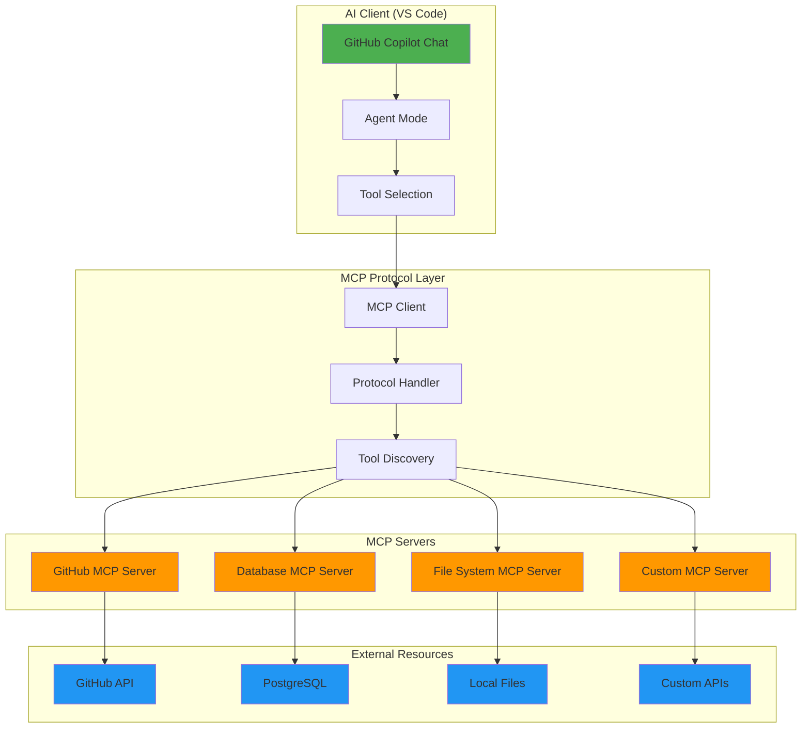

# Model Context Protocol (MCP) Guide
## Enhancing AI Development with Advanced Context Management

**Duration: 40 minutes**  
**Difficulty: Intermediate**

## 🎯 Learning Objectives

By the end of this section, you will:
- **Understand Model Context Protocol (MCP)** and its benefits for AI development
- **Setup MCP in VS Code** with proper configuration
- **Use MCP effectively** for enhanced code generation and assistance
- **Implement practical MCP patterns** for real-world development scenarios
- **Optimize context management** for better AI responses

## 📋 Prerequisites

- VS Code with GitHub Copilot extension installed
- GitHub Copilot subscription (Individual or Business)
- Basic understanding of VS Code settings and extensions
- Familiarity with the project structure and Clean Architecture patterns

## 🔍 What is Model Context Protocol (MCP)?

Model Context Protocol (MCP) is an open protocol and ecosystem that enables AI assistants, agents, and tools to interact with external resources, APIs, and data in a secure, standardized, and extensible way.

- **Purpose:** MCP bridges the gap between LLMs/AI agents and real-world tools, APIs, and data sources, allowing for safe, auditable, and composable tool use.
- **How it works:** MCP defines a standard for how clients (like AI assistants) and servers (which expose tools/resources) communicate. Servers expose tools as structured APIs, and clients can discover, invoke, and chain these tools.
- **Ecosystem:** There are hundreds of open-source MCP servers for databases, cloud services, code repositories, productivity tools, and more. You can run servers locally, in the cloud, or use hosted options.
- **Security:** MCP is designed for secure, permissioned access. You control which tools are available, and all actions are explicit and auditable.
- **Extensibility:** Anyone can build and share new MCP servers, making it easy to add new capabilities to your AI workflows.

### Why MCP?

- **Standardization:** Avoids ad-hoc integrations and prompt hacks by providing a clear, structured interface for tool use.
- **Composability:** Tools can be combined and orchestrated by AI agents for complex workflows.
- **Transparency:** All tool calls are explicit, logged, and reviewable.
- **Community:** A growing ecosystem of open-source servers and clients, with active collaboration and sharing.

### Example Use Cases

- Letting an AI assistant run code, query databases, or manage cloud resources securely.
- Automating DevOps, code review, or documentation tasks from chat.
- Connecting LLMs to business data, APIs, or custom tools in a controlled way.

For more, see the [official MCP introduction](https://modelcontextprotocol.io/introduction).

### MCP Architecture

The Model Context Protocol follows a client-server architecture that enables secure, standardized communication between AI assistants and external tools:



**Key Components:**

- **AI Client**: Your VS Code environment with GitHub Copilot Chat in Agent Mode
- **MCP Protocol Layer**: Handles communication, tool discovery, and security
- **MCP Servers**: Specialized servers that expose tools and resources (GitHub, databases, file systems, etc.)
- **External Resources**: The actual APIs, databases, and services that MCP servers interact with

This architecture ensures that AI assistants can safely access external tools while maintaining security, auditability, and extensibility.

## 🚀 Step 1: MCP Setup in VS Code

### 1.1 Prerequisites

Before setting up MCP in VS Code, ensure you have:

1. **Visual Studio Code**: Latest version installed (1.99+)
2. **GitHub Copilot**: Active subscription and extension installed
3. **GitHub Copilot Chat**: Extension installed

```bash
# Via VS Code Command Palette (Ctrl/Cmd + Shift + P)
ext install GitHub.copilot
ext install GitHub.copilot-chat
```

### 1.2 Enable MCP Support

MCP support in VS Code is available in version 1.99 and above (currently in preview).

1. Open VS Code settings (Ctrl/Cmd + ,)
2. Search for "chat.mcp.enabled"
3. Check the box to enable MCP support
4. Optionally enable auto-discovery with "chat.mcp.discovery.enabled" setting

```json
{
  "chat.mcp.enabled": true,
  "chat.mcp.discovery.enabled": true
}
```

## 🔧 Step 2: Integrating the GitHub MCP Server

While `@workspace` provides powerful context about your local project, the **GitHub MCP Server** connects your AI assistant directly to your remote repositories, enabling actions like creating issues, managing pull requests, and modifying files.

### 2.1 Introduction to the GitHub MCP Server

The GitHub MCP server is a specialized server that allows your AI assistant to interact with the GitHub API on your behalf.

**Key Features:**
- **File Operations**: Create, update, and read files in your repository.
- **Branch Management**: Create and manage branches.
- **Pull Requests**: Create, review, and comment on pull requests.
- **Issue Tracking**: Create, update, and search for issues.
- **Code Search**: Perform advanced searches across your repositories.

### 2.2 Setup and Configuration

To use the GitHub MCP Server, you need to configure it in VS Code.

#### 1. Create a GitHub Personal Access Token (PAT)

You'll need a [GitHub Personal Access Token](https://github.com/settings/tokens) with the following scopes:
- `repo`: Full control of private repositories
- `workflow`: For interacting with GitHub Actions
- `write:packages`: To publish packages
- `delete:packages`: To delete packages

#### 2. Configure VS Code

Create a `.vscode/mcp.json` file in your project root and add the following configuration. This method is recommended for team projects as it can be checked into source control (ensure your PAT is stored securely, e.g., using a VS Code input prompt).

**Note:** You can choose between `npx` (runs from the npm registry) or `docker` (runs in a container).

```json
{
  "mcp": {
    "inputs": [
      {
        "type": "promptString",
        "id": "github_token",
        "description": "GitHub Personal Access Token",
        "password": true
      }
    ],
    "servers": {
      "github": {
        "command": "npx",
        "args": [
          "-y",
          "@modelcontextprotocol/server-github"
        ],
        "env": {
          "GITHUB_PERSONAL_ACCESS_TOKEN": "${input:github_token}"
        }
      }
    }
  }
}
```

Alternatively, you can add this to your global User `settings.json`.

### 2.3 Verify GitHub MCP Server Integration

After configuring the server, restart VS Code and test the integration with a simple command in the Copilot Chat:

```
@github get_issue --owner=<your-github-username> --repo=demo-inventory-microservice --issue_number=1
```

If successful, it will attempt to retrieve information about issue #1 from your repository.

## 🚀 Step 3: Using GitHub MCP Server in VS Code

Now you can combine `@workspace` and `@github` for a powerful workflow that spans your local development environment and remote repositories.

### 3.1 GitHub MCP Server Use Cases and Simple Examples

The GitHub MCP server enables key workflows for repository management directly from VS Code:

#### 📁 Repository Exploration

**Browse repository files:**
```
Get the README file from my repository
```

**Search for specific code:**
```
Find all ProductService references in my C# files
```

#### 🐛 Issue Management

**Create a new issue:**
```
Create an issue titled "Add product validation" with description "Need to add validation for product creation"
```

**Comment on an issue:**
```
Add a comment to issue #5 saying "I'm working on this feature"
```

**Check issue status:**
```
Show me details for issue #10
```

#### 🔀 Pull Request Workflow

**Create a branch:**
```
Create a new branch called "feature/product-validation"
```

**Create a pull request:**
```
Create a PR from my feature branch to main with title "Add product validation feature"
```

**Review a PR:**
```
Show me the files changed in PR #8
```

#### 🔍 Code Search

**Find specific patterns:**
```
Search for "async Task" in all C# files in this repository
```

**Look for implementations:**
```
Find all files that contain "IProductRepository"
```

#### 🚀 Quick Workflows

**Bug fix workflow:**
```
1. Create an issue for the bug
2. Create a branch to fix it
3. Make the code changes
4. Create a PR
```

**Feature request workflow:**
```
1. Check if similar issues exist
2. Create a detailed feature request
3. Get team feedback through comments
```

#### 💡 Pro Tips

- Use simple, conversational language - the AI will translate to the appropriate GitHub actions
- Combine `@workspace` and GitHub commands for context-aware development
- Let the AI suggest the best approach for complex workflows

**Example combined prompt:**
```
@workspace What's our current product entity structure?
Based on that, create a GitHub issue for adding supplier management with similar patterns.
```


